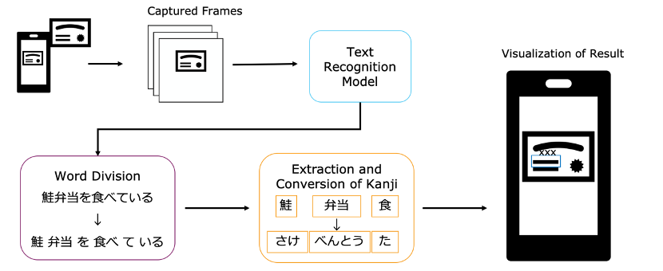
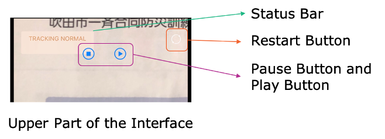
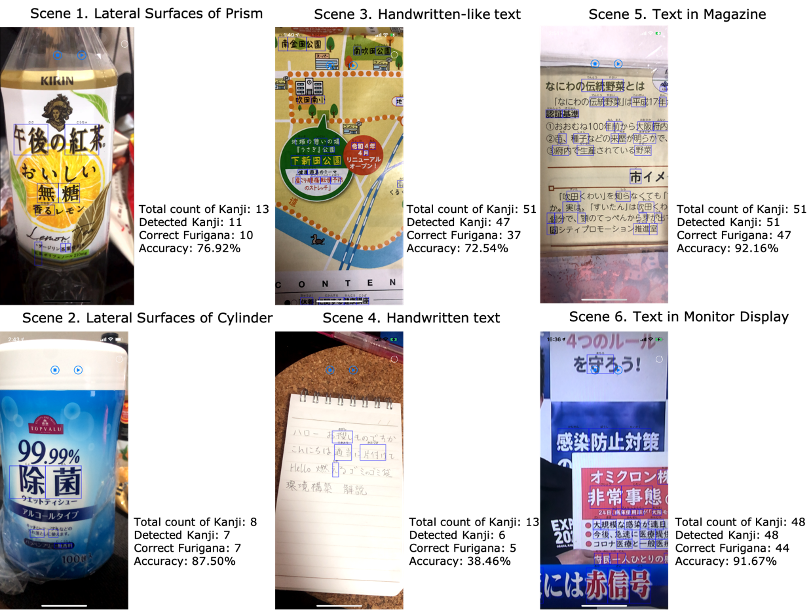
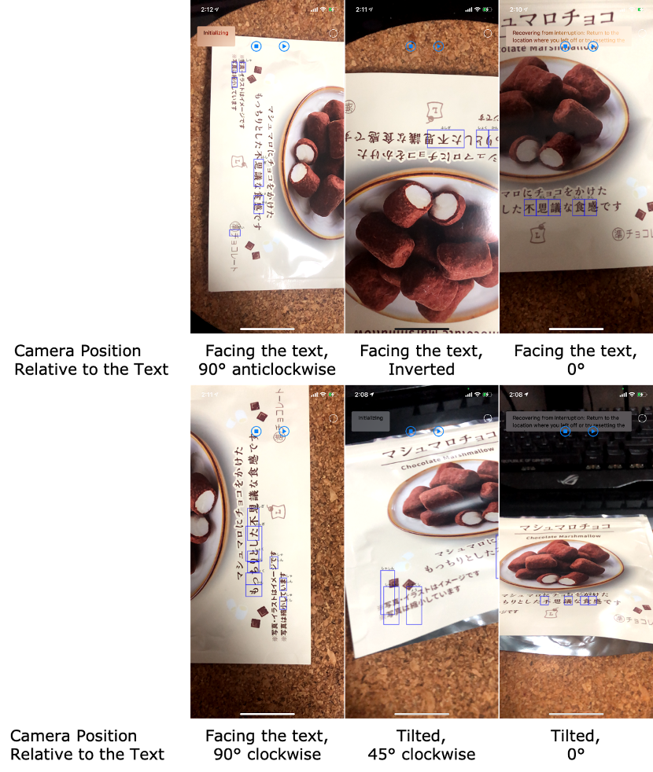
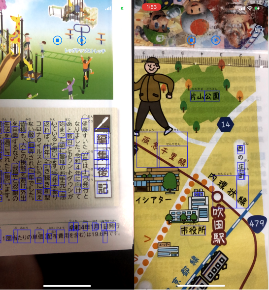

# AR_Furigana
This is a repo for my coursework AR Furigana for Mixed Reality Systems

## Motivation

The pronunciation of _kanjis_ is usually a challenging problem for students learning Japanese. Even for native Japanese, some _kanjis_ are difficult to read. Many people search for the pronunciation on the Internet when they meet _kanjis_ they do not know how to read. However, smartphones generally only provide _romaji_ input or _kana_ input for Japanese, so they have to know how to read the _kanji_ to input it into their smartphone. Therefore, I implemented an iOS application, AR Furigana, that recognizes Japanese text and shows the pronunciation (_furigana_) above the text. This application aims to reduce the effort of the user to find the pronunciation of _kanjis_.

## Technical Details

Fig. 1. The pipeline of AR Furigana.

### The Pipeline of the Application

Figure 1 shows the pipeline of the application “AR Furigana”. ARKit and Vision packages are used to implement the application. AR Furigana sets up an AR session by ARSKView, which is a view class in ARKit that blends 2D elements in 3D space within the device camera view of the real world. iPhone’s camera is used to capture the real environment. The current captured frame is passed to Vision for further processing. Note that the frames captured by ARKit are 90° clockwise rotated compared to the device camera. A queue handles the further processing of each frame. When the operations for a frame are done, the frame is released, and the next frame will be processed. AR Furigana is tested on iPhone X with iOS 14.2.

### Text Recognition

As Vision only provides text detection, AR Furigana cannot recognize the text directly using the Vision Framework. Therefore, the Text Recognition V2 API provided by MLKit of Google is integrated into the application to recognize Japanese text. Text Recognition V2 API offers text recognition on-device. If Text Recognition V2 API operates successfully, it returns the full text recognized in the frame and the rectangular bounding boxes of text in blocks. Each text block contains zero or more lines of text and their bounding boxes. Each line of text contains zero or more word or word-like elements and their bounding boxes.

### Word Division and Hiragana Conversion

Most Japanese texts are written consistently without punctuation to separate words. Therefore, the smallest unit that AR Furigana receives is a line of text. Although it is possible to convert the line of text directly, the exact furigana for the _kanjis_ in the text is implicit. The application also needs to handle converting a large amount of text that does not require any conversions. Hence, AR Furigana uses the tokenizer of Mecab to separate the recognized text, extract the _kanjis_ and generate their _hiragana_ representations with consideration of context and _okurigana_.

### Visualization of the result

The original _kanji_ should be shown explicitly to display the furigana, and the _furigana_ should be put next to the _kanji_ without covering it. AR Furigana receives the bounding box of the whole line and calculates the bounding box of extracted _kanjis_ by the ratio of the kanji vocab’s word count to the whole line’s word count. To support vertical text, AR Furigana also assumes the text is vertical when the width of the bounding box of the line of text is larger than its height (as it is 90° clockwise rotated). AR Furigana transforms the coordinates of bounding boxes to fit in the device screen using displayTransform() in ARKit. Then it visualizes the recognized _kanjis_ by bounding them with rectangles. The _furigana_ is shown above the bounding rectangles.

### User Interface Pause and Restart Session

AR Furigana keeps tracking the text in the captured frames and continuously shows the _furigana_ of detected _kanjis_. It is difficult to read when the displayed result keeps changing. Therefore, as shown in Fig. 2, there are pause and play buttons to pause and temporarily resume the AR Furigana session. There is also a restart button on the top right of the interface for restarting the AR session when unexpected errors occur.

Fig. 2. The Interface of AR Furigana

## Results
### Evaluation of Different Scenes

Fig. 3. Results of different scenes in the real environment. Accuracy is calculated by correct _furigana_ divided by the total count of _kanji_.

I evaluate AR Furigana in different scenes in the real environment. The result is shown in Fig. 3. AR Furigana shows good recognition and conversion results in normal printed text (Scene 5,6). The bounding boxes are also mostly correct despite some misalignment. There are more undetected _kanjis_ for lateral surfaces of bottles (Scene 1,2). As the bounding boxes are rectangles, some look misaligned even if the locations are correct. For handwritten text or handwritten-like text (Scene 3,4), the recognition accuracy is apparently lower than normal printed text. In contrast, the locations of bounding boxes for detected _kanjis_ are mostly correct, which does not have much difference compared to Scene 5,6, subjectively.

### Camera from Different Angles

Fig. 4. Result of different camera positions relative to the text.

I also conducted an experiment on the impact that different camera positions bring on the result of AR Furigana. When the camera _faces the text_, AR Furigana can recognize the text and convert the _kanjis_ in all settings. However, it visualizes the result correctly only in _0°_ and _90° anticlockwise_ settings as the order of the text is the same as horizontal and vertical text, respectively. In _90° clockwise_ and _inverted_ settings, the order of the bounding box and _furigana_ is incorrect. For tilted settings, some text is not detected while the recognized _kanjis_ are converted and visualized correctly. However, in the _tilted_, _45° clockwise_ setting, the rectangle bounding boxes do not properly show the recognized _kanjis_.

### Text of Different Orientations

Fig. 5. Results for frames containing text in different orientations.

Figure 5 shows the result of frames containing text in different orientations. The left in Fig. 5 contains both vertical and horizontal text, while the right contains vertical, horizontal, and oblique text. AR Furigana can recognize and visualize the text on the left, though the furigana of vertical text is difficult to read due to its position. AR Furigana can also recognize the oblique text on the right, though the bounding boxes do not fit the text.

## Discussion

The aim of recognizing Japanese text and showing the pronunciation (_furigana_) above the text is achieved in AR Furigana. However, there are still many issues. The first issue is the processing speed. As AR Furigana needs to process every captured frame on-device, it becomes very slow, especially when the camera captures much text.

Moreover, readability is also a main issue. The bounding boxes are set to be rectangles, and the _furigana_ is always above the bounding box despite the direction of the text. It will be preferable that bounding boxes can fit the recognized text, and the _furigana is_ shown above the box when the text is horizontal and shown at the left when it is vertical. Also, the font size of the _furigana_ should be adjusted according to the length of the _kanjis_. When the frame is full of text, there is little space for showing _furigana_. It is crucial to consider where to show the _furigana_ to improve the readability.

Now, AR Furigana cannot show the _furigana_ in the correct order when the camera is 90° clockwise or inverted position relative to the text. It is probably due to calculating the _kanji_ bounding box from the bounding box of the whole line. It assumes the vocabularies follow the normal writing direction (left to right or up to down) without considering the orientation of the frame.

## Conclusion and Future Work

AR Furigana is an iOS application that uses the device camera to capture the real environment and shows the _furigana_ of recognized _kanjis_ on the device screen. Users can directly obtain the pronunciation of _kanjis_ offline. It shows good results in the recognition and visualization of normal printed text. However, there are still many issues with processing speed and readability performance. In future works, I aim to improve the performance of AR Furigana and make it adaptable for all camera positions relative to the text. Moreover, it is desired to fit the bounding box and color and font size of the _furigana_ according to the recognized text. _Furigana_ anchors can also be added to the processed text so that the location of the _furigana_ will not change, and the application does not need to process the exact text again.
